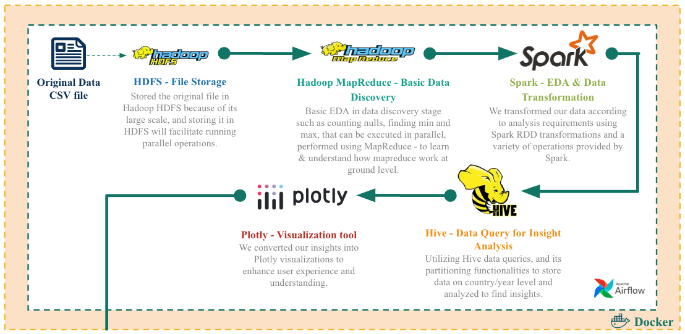

# world-energy-stats

https://world-energy-stats-34l3s.ondigitalocean.app/


## Overview
Significant shifts in global energy dynamics over the past 50 years, driven by technology advancements, emerging energy sources, and growing climate awareness, highlight the need for understanding and analyzing changes in energy consumption.

Using Big Data tools, this project analyzes consumption trends for primary energy sources on global/country level over the past few decades and generate insights.

Final Project for MDS @ TMU Course - DS8003. 

### Data Pipeline Architecture



## Contributors

<!-- ALL-CONTRIBUTORS-LIST:START - Do not remove or modify this section -->
<!-- prettier-ignore-start -->
<!-- markdownlint-disable -->
<table>
  <tbody>
    <tr>
      <td align="center" valign="top" width="14.28%"><a href="https://github.com/Amarpreet3"><br /><sub><b>Amarpreet Kaur</b></sub></a><br /><a href="#data-Amarpreet3" title="Data">🔣</a><a href="#code-Amarpreet3" title="Code">💻</a></td>
      <td align="center" valign="top" width="14.28%"><a href="https://github.com/ruchithakor"><br /><sub><b>Ruchi </b></sub></a><br /><a href="#data-ruchithakor" title="Data">🔣</a> <a href="#code-ruchithakor" title="Code">💻</a></td>
    </tr>
  </tbody>
</table>

<!-- markdownlint-restore -->
<!-- prettier-ignore-end -->

<!-- ALL-CONTRIBUTORS-LIST:END -->


## Citation
This project uses the awesome data from OWID.

Hannah Ritchie, Max Roser and Pablo Rosado (2023) - “Energy” Published online at OurWorldInData.org. Retrieved from: 'https://ourworldindata.org/energy' [Online Resource]


## Running Locally

```bash
docker compose up airflow-init
```

```bash
docker compose down --volumes --remove-orphans
```

```bash
docker exec spark-notebook jupyter server list
docker exec -it hive-server hive
```

```bash
hdfs dfs -ls -R /app-logs
```

#### Services
| App     | Server             | Link                          |
| ------- | ------------------ | ----------------------------- |
| Hadoop  | ResourceManager UI | http://localhost:8088/cluster |
| Hadoop  | Namenode UI        | http://localhost:9870/        |
| Hadoop  | NodeManager UI     | http://localhost:8842         | 
| Jupyter | Notebook UI        | http://localhost:8888/        |
| Airflow  | Web Server UI      | http://localhost:8082/        |
| Spark   | Master             | http://localhost:8080/        |
| Spark   | Worker 1           | http://localhost:8081/        |
| Spark   | Worker 2           | http://localhost:8083/        |


## Project Structure
```~/world-energy-stats# tree --gitignore -L 3
.
├── README.md
├── airflow
│   ├── config
│   ├── dags
│   │   └── run_data_transformation.py
│   ├── logs
│   │   ├── dag_id=data_transformation
│   │   ├── dag_processor_manager
│   │   └── scheduler
│   └── plugins
├── dash-app
│   ├── assets
│   │   ├── big-players.png
│   │   ├── data
│   │   ├── electricity-mix.png
│   │   ├── energy-consumption.png
│   │   ├── energy-gdp-pop.png
│   │   ├── energy-mix.png
│   │   └── styles.css
│   └── components
│       ├── insight_1.py
│       ├── insight_2.py
│       ├── insight_3.py
│       ├── insight_4.py
│       └── insight_5.py
├── docker-compose.env
├── docker-compose.yml
├── energy-data
│   ├── README.md
│   ├── owid-energy-codebook.csv
│   └── owid-energy-data.csv
├── notebooks
│   ├── clean
│   ├── eda.ipynb
│   ├── hive_queries_ak-1.ipynb
│   ├── hive_queries_ak.ipynb
│   ├── hive_queries_kc.ipynb
│   ├── output
│   ├── spark_etl_countries.ipynb
│   ├── spark_etl_world.ipynb
│   ├── spark_hive_test.ipynb
│   └── utils.py
├── requirements.txt
├── scripts
│   ├── hadoop
│   │   ├── eda_pandas_mapper.py
│   │   ├── eda_pandas_reducer.py
│   │   ├── null_percent_mapper.py
│   │   └── null_percent_reducer.py
│   └── pyspark
│       ├── data_categorization.py
│       ├── data_transformation.py
│       └── utils.py
├── setup.sh
└── sql
    ├── 1_energy_overview.sql
    ├── 2_energy_consumption_pct_rem.sql
    ├── 2_energy_consumption_pct_top15.sql
    ├── 2_energy_consumption_top15.sql
    ├── 3_energy_breakdown_top15.sql
    ├── 4_electricity_gen_top15.sql
    ├── 4_electricity_share_top15.sql
    ├── 5_population_correlation.sql
    ├── combined_energy_data.sql
    └── energy_share.sql
```

